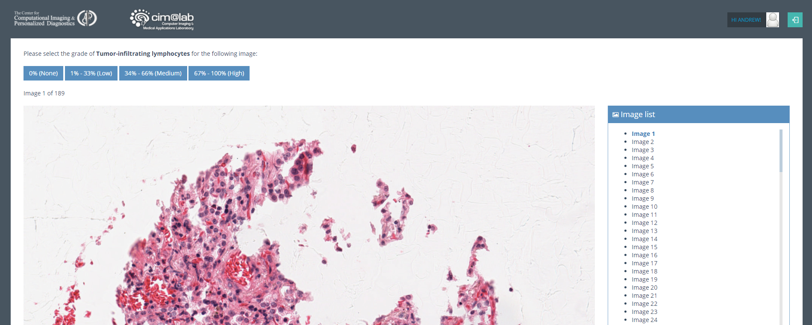

# QuickReviewer

A quick web user interface which allows multiple user to rapidly review images and assign them a value

## Use Case
We have a number of histology images which we would like a set of experts to categorize into one of 4 categories (none, low, medium, high).

This app will show them the image and the 4 associated buttons and record their result. 

Afterwards, one can look at the statistics of their results using the *res.php* and *res_comp.php* pages 

## Requirements
Apache, php, mysql

## Installation
1. Create new mysql database
2. Edit *bd_script.sql* to have image filenames, and run script in mysql
3. Edit *Constants.php* to specify database name, location, username, password, etc
4. Copy *app* directory to apache target directory
5. Copy images to *resources* directory
6. Thats it!

## Citing

This work was developed for and used in this manuscript, please cite it!

    @proceeding{doi: 10.1117/12.2286717,
        author = { Paula  Toro,Germán  Corredor,Xiangxue  Wang,Viviana  Arias,Vamsidhar  Velcheti,Anant  Madabhushi,Eduardo  Romero},
        title = {Quantifying expert diagnosis variability when grading tumor-infiltrating lymphocytes},
        journal = {Proc.SPIE},
        volume = {10572},
        number = {},
        pages = {10572 - 10572 - 8},
        year = {2017},
        doi = {10.1117/12.2286717},
        URL = {http://dx.doi.org/10.1117/12.2286717},
        eprint = {}
    }

###### This project was entirely coded by German Corredor Prada and is hosted here with his permission